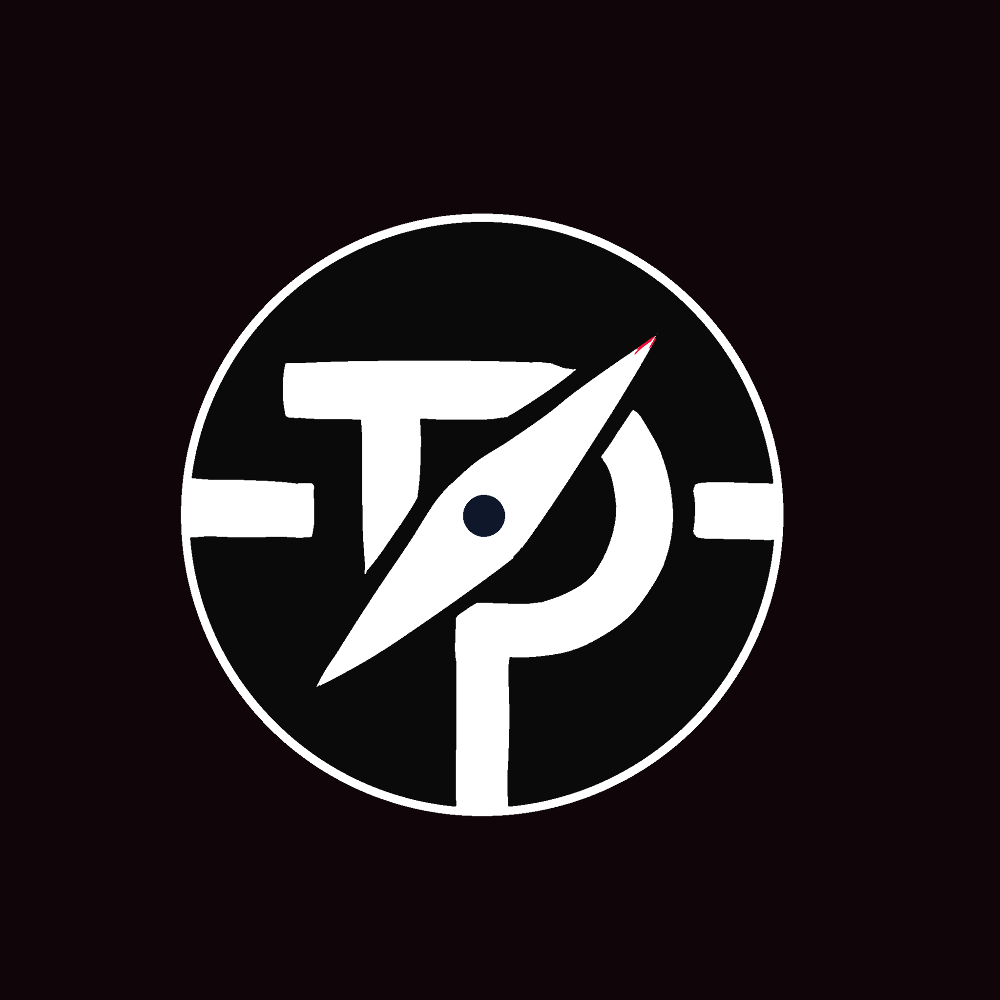
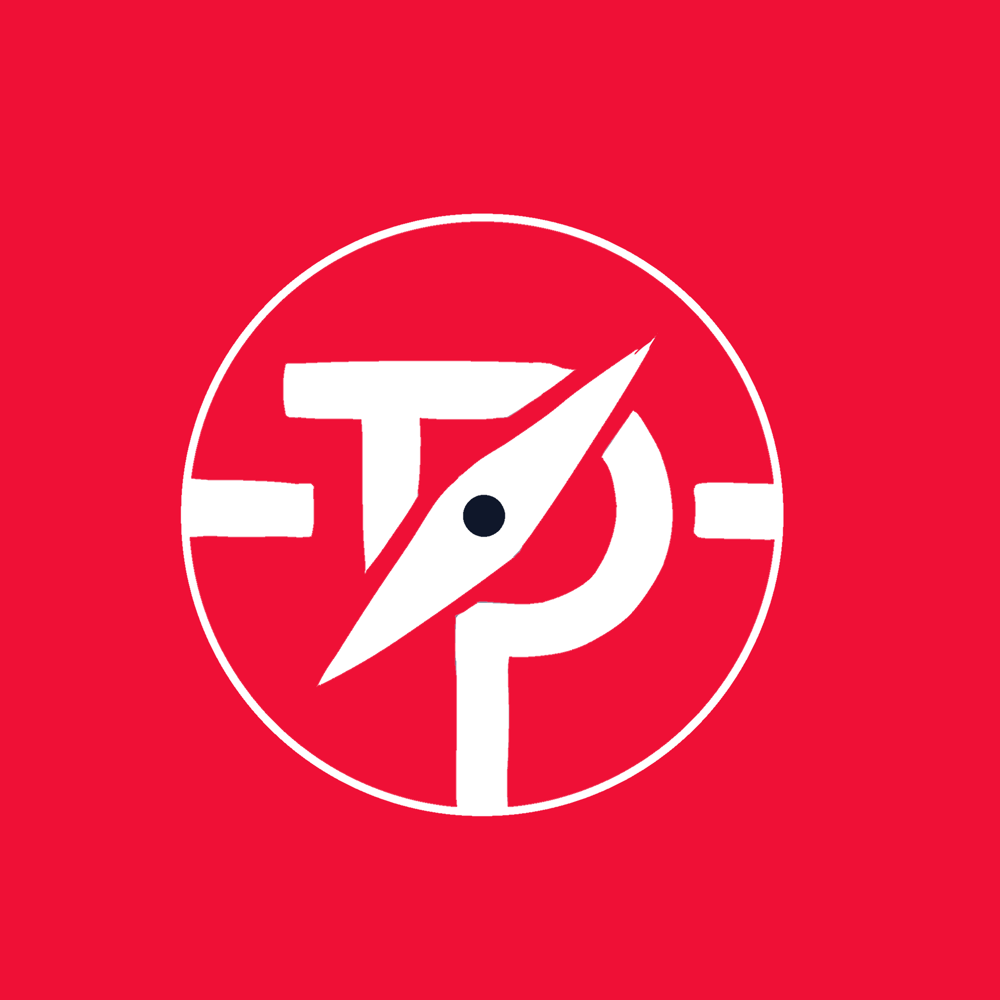
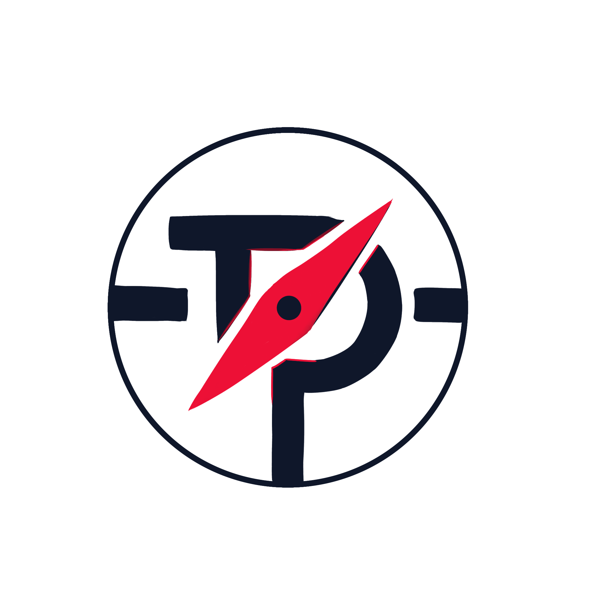
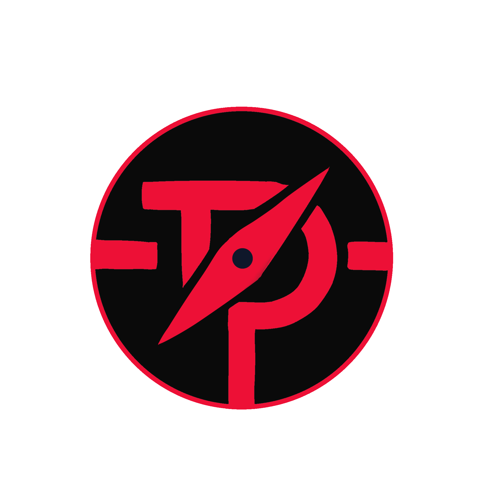

<<<<<<< HEAD
# Tracking Project v1 - Puchy
=======
# 🚀 Tracking Project v1 - Puchy
>>>>>>> e153250351450b5ad61dc9f8f43f7ac36403e4a1

[](https://github.com/emizaff)
[](https://bun.sh)
[](https://ubuntu.com)


**Tracking Project** adalah project manajemen produktivitas modern yang menggabungkan elemen RPG (Level/XP) dengan pelacakan tugas real-time. Proyek ini dibangun sebagai bagian dari resolusi tantangan **12 Project dalam 1 Tahun (2026)**.

<p align="center">
  
  <br>
  <i>Tampilan Dashboard Utama</i>
</p>

---

## 🎭 Tentang Proyek (About)
Proyek ini lahir dari keinginan untuk membuat fitur CRUD sesuai keinginan pribadi sebagai tracking dari resolusi. Fokus utamanya adalah membangun ekosistem kerja yang imersif di lingkungan **WSL (Windows Subsystem for Linux)** dengan efisiensi tinggi menggunakan **Bun**.


---

## ✨ Fitur Unggulan
- **RPG Leveling System:** Setiap tugas yang selesai memberikan XP untuk menaikkan level user.
- **Activity Heatmap:** Visualisasi konsistensi kerja 120 hari terakhir ala kontribusi GitHub.
- **Smart Task Management:** Input tugas cepat dengan mode **Timer (Fokus)** atau **Counter (Jumlah)**.
- **Loot & Wishlist:** Sistem tabungan otomatis untuk melacak progress pembelian barang impian.
- **Interactive Reports:** Analisis mendalam mengenai jam fokus dan rasio penyelesaian tugas mingguan.
- **Admin Control Center:** Dashboard privat untuk mengelola seluruh data proyek secara aman.

---

## 🛠️ Tech Stack
- **Runtime:** [Bun](https://bun.sh) (Fast JavaScript runtime & package manager).
- **Backend:** [Elysia.js](https://elysiajs.com) & [Drizzle ORM](https://orm.drizzle.team).
- **Database:** PostgreSQL (Hosted on [Neon DB](https://neon.tech)).
- **Frontend Dashboard:** [React 18](https://reactjs.org) (Vite) & [Tailwind CSS](https://tailwindcss.com).
- **Web Public:** [Astro](https://astro.build) (Static Site Generation - Coming Soon).

---

## 📥 Panduan Instalasi (Local Development)

Pastikan Anda menjalankan perintah ini di dalam lingkungan **WSL (Ubuntu)**.

### 1. Install Bun
Jika belum ada, install Bun terlebih dahulu:
```bash
curl -fsSL [https://bun.sh/install](https://bun.sh/install)
```
### 2. Clone Repository
```bash
git clone [https://github.com/emizaff/tracking-project.git](https://github.com/emizaff/tracking-project.git)
cd tracking-project
```

### 3. Setup Backend (Server)

```bash
cd server
bun install
```
Buat file ```.env``` di folder server dan isi dengan ```DATABASE_URL```  PostgreSQL Anda.

Jalankan migrasi database:
```bunx drizzle-kit push```

Jalankan server: ```bun dev```

### 4. Setup Admin Dashboard
Buka terminal baru di WSL:
```bash
cd tracking-project/admin-dashboard
bun install
bun dev
```
Akses dashboard di: ```http://localhost:5173```

---
## 🏁 Resolusi 2026: 12 Projects Challenge
- [x] Project 1 (Jan-Feb): Tracking Project (Tracking-Project) - **SELESAI**
- [ ] Project 2 (Maret): **(Segera Hadir)**

---

## 🎨 Branding Guide
- Background: ```#090909``` (Pure Dark)
- Component Card: ```#1A1A1A``` (Dark Grey)
- Accent Color: ```#f01036``` (Neon Red)
- Text: `#ffffff` (Primary), ```#888888``` (Secondary)

### Logo
<p align="center">
   
  
  
  
  
  <br>
  <i>Beberapa Logo dengan variasi warna yang berbeda</i>

</p>
